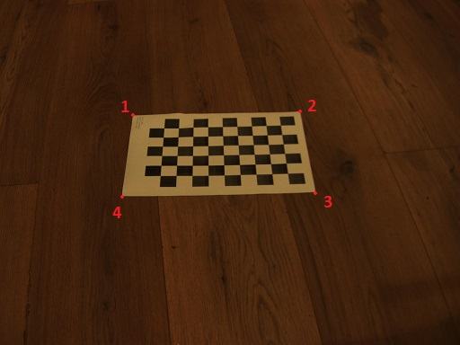
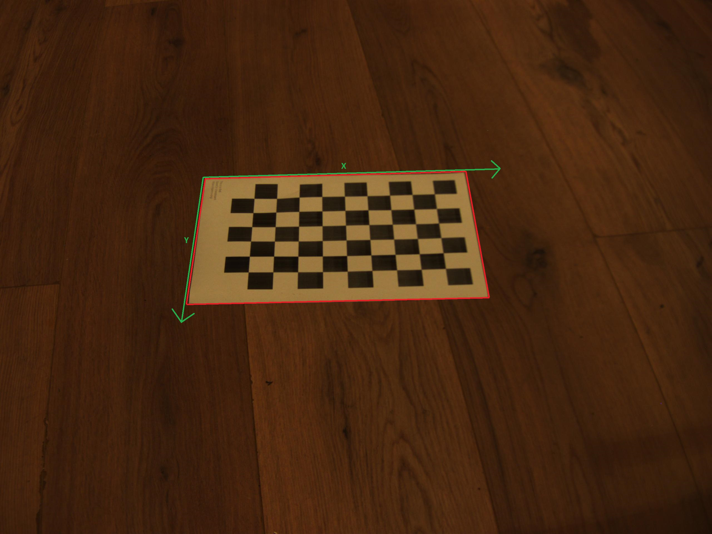

# Camera calibration

This is a software made for a recruitment test.  
The goal is to have a program that take as input an image with a calibration A4 paper in it.  
The user can then click on the 4 corner of the paper and the programm will compute the position of the camera in the real world coordinate by using the camera parameters.  

## Installation 
### Requirement
* opencv
* cmake
* gtest

### Compilation

    mkdir build
    cd build
    cmake ..
    make

## How to use

To launch the programm you must type the command :

    ./Camera_Calibration ../img/calibration.jpg
    
Then you must select the corners of the calibration paper in the displayed window by clicking on them in a specific order.
 

If you want to compute the camera position : press the 'c' key on your keyboard.  
If you want to reset the selected corners : press the 'r' key in your keyboard.  
If you want to leave the software : press the 'esc' key in your keyboard.

The result of the camera position computation will be displayed in the terminal.    
The axes of references of the world coordinates are based on the chosen points, the origin being the first chosen point.    

This picture show you how the real axes are determined ( the paper is at 0 on the Z axe) :  

## Documentation

The doxygen documentation is generated in the doc folder.  
If you want to update the documentation you can regenerate it with the command :  
    
    doxygen doxyfile

## CI

After each commit a github action will create a correct environment and it will try to compile the code and run the tests.  
You can check the **Actions** of the depository too see the CI in more details.  

To run the test manually you can run the following command :  

    mkdir build
    cd build
    cmake ..
    make
    ctest

## Future possible improvement

* Function to compute the correct order of the corners so that the user can click on them in any order
* Draw the X and Y real world axes on the window
* Show results on the displayed window